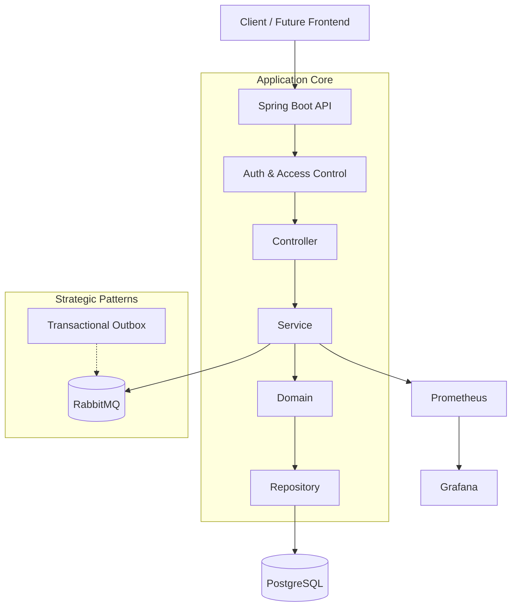

# Orkestra360 — Mission-Critical SaaS Backend

**Orkestra360** is a multi-tenant, event-driven task and workflow orchestration platform. It is engineered as a production-grade system, prioritizing architectural integrity, scalability, and deep observability over rapid prototyping.

Unlike traditional CRUD applications, Orkestra360 serves as a technical lighthouse for modern backend engineering. It demonstrates the evolution from a modular monolith to a distributed architecture, solving real-world challenges such as strict data isolation, complex business state transitions, and asynchronous consistency.


## Engineering Objectives

- **Domain-Driven Excellence:** Encapsulating complex business logic within Rich Domain Models and Value Objects to eliminate anemic domain models.
- **Robust Multi-Tenancy:** Implementing strict logical data segregation and tenant-aware resource scoping to ensure SaaS security.
- **Event-Driven Resilience:** Utilizing asynchronous messaging (RabbitMQ) to decouple high-load workflows and ensure eventual consistency.
- **Observability-First Mindset:** Embedding telemetry, structured logging, and health checks into the core to ensure system transparency.
- **Architectural Rigor:** Following a phased approach where every increment is backed by SOLID principles, design patterns, and automated quality gates.


## Architecture Overview




## Core Architectural Principles

- **Domain-Driven Design (DDD):** Business logic as the center of the universe.
- **Hexagonal/Layered Hybrid:** Clear separation between infrastructure and domain.
- **Tenant Isolation:** Mandatory scoping for all data access.
- **Stateless Execution:** Designed for horizontal elasticity.
- **Eventual Consistency:** Managed through robust message brokering.


## Tech Stack & Infrastructure

| Category | Technology | Role in the System |
| :--- | :--- | :--- |
| Runtime | Java 17 + Spring Boot 3 | High-performance core with modern dependency injection. |
| Persistence | PostgreSQL + Flyway | ACID-compliant storage with versioned migrations. |
| Messaging | RabbitMQ | Reliable message broker for workflow orchestration. |
| Observability | Prometheus & Grafana | Real-time telemetry and health monitoring (Planned). |
| DevOps | Docker & Compose | Environment parity across development and staging. |
| CI/CD | GitHub Actions | Automated quality gates, testing, and delivery pipelines (Planned). |


## Directory Structure

```plaintext
orkestra360/
├── docs/                       # Specifications, ADRs, and Business Requirements
│   ├── assets/                 # Architecture diagrams and media
│   ├── bruno/                  # API collections for rapid testing
│   └── BRD.md                  # Business Requirements Document (Source of truth)
├── scripts/                    # Automation and CI utility scripts
├── src/
│   ├── main/
│   │   ├── java/com/project/orkestra360/
│   │   │   ├── config/         # Framework and infrastructure beans
│   │   │   ├── controller/     # Presentation Layer (REST)
│   │   │   ├── domain/         # Core Domain Layer (Entities, VOs, Events)
│   │   │   ├── dto/            # API Contracts (Java Records)
│   │   │   ├── exception/      # Domain & Global Error Handling
│   │   │   ├── repository/     # Persistence Abstractions (Output Ports)
│   │   │   └── service/        # Application Orchestration Layer
│   │   └── resources/          # Configuration and DB migrations
│   └── test/                   # Unit, Integration, and Architecture tests
├── docker-compose.yml          # Docker orchestration and environment setup
├── Dockerfile                  # Application container image definition
├── Makefile                    # Standardized task runner for common operations
├── pom.xml                     # Dependency management
└── README.md                   # Project overview and documentation
```


## Development Strategy (Phased Evolution)

### Phase 1 — Foundation (Completed)
Established the structural scaffolding, DDD layers, and multi-tenant aware base.

### Phase 2 — Core Domain & Task Engine (In Progress)
Implementing rich behavior for Tasks and Workflows. Moving away from simple CRUD to state-machine driven logic within entities.

### Phase 3 — Identity & Access (IAM)
Standardizing JWT-based Auth, RBAC, and cross-tenant leakage prevention.

### Phase 4 — Resilience & Messaging
Implementing Transactional Outbox Pattern to ensure atomicity between DB state changes and RabbitMQ event publishing.

### Phase 5 — Full-Stack Observability
Exposing Actuator metrics to Prometheus and building Grafana dashboards for throughput and error rates.

### Phase 6 — Performance
Optimize with Redis caching and query improvements.

### Phase 7 — Advanced Security
Enhance with ABAC and fine-grained policies.

For detailed tasks, rules, and guardrails, see `docs/BRD.md`.


## API Design & Tenant Scoping

The API is designed with Tenant-First semantics. Every resource is scoped via tenantId, ensuring that even at the URL level, data boundaries are explicit.

- **Resilience**: Global exception handling with RFC-7807 problem details.
- **Evolution**: Versioning-ready endpoints.

**API Documentation** is auto-generated via Springdoc OpenAPI and available at `/swagger-ui.html`.


## Architectural Decisions (ADRs)

- **Rich Domain Models**: Business rules live in the Domain, not in Services.
- **Interface-Based Repositories**: Ensuring the Domain remains agnostic of the persistence framework.
- **Fail-Fast Validation**: Using Bean Validation and custom domain assertions to prevent invalid state transitions.


## Future Frontend

A dedicated frontend application (React-based) will be developed separately to provide:

* Operational dashboards
* Real-time system metrics visualization
* Task and workflow management UI


## Getting Started

| Command | Action |
| :--- | :--- |
| `make dev` | Launch application with dev profile (hot reload) |
| `make build` | Compile and package the application |
| `make up` | Start the full environment (app/DB/MQ) |
| `make down` | Stop the full environment (app/DB/MQ) |
| `make test` | Execute full test suite |


## Current Status

- **Current Project Status**: Phase 2 Midpoint
- **Status**: In Progress (50% complete)
- **Current Focus**: Transitioning from Domain/Persistence to API Exposure