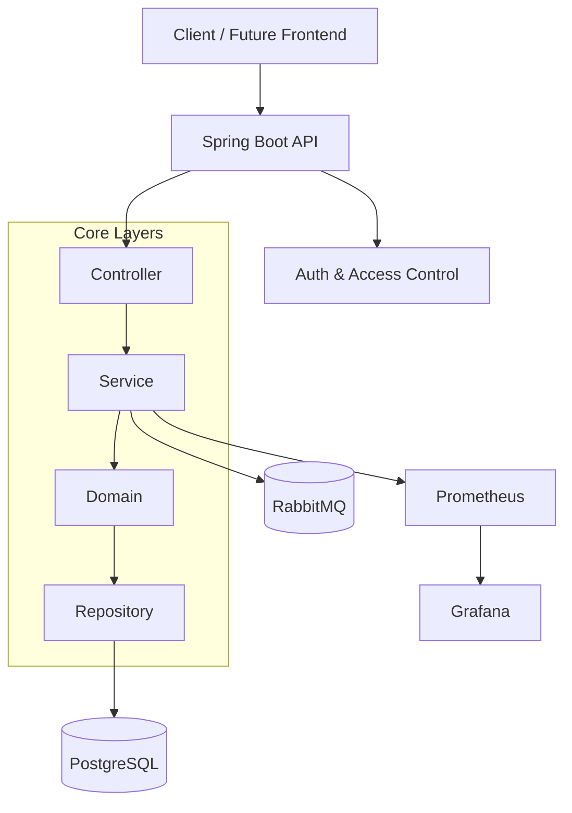

# Orkestra360 — Backend

**Orkestra360** is a SaaS, multi-tenant, event-driven backend platform designed to simulate a **production-grade system** with strong emphasis on architecture, scalability, and observability.

This project is intentionally built as a **learning-driven system**, focusing on applying real-world engineering practices expected at mid/senior levels, rather than delivering a quick MVP.

The development follows an **incremental, phase-based approach**, where each phase introduces new architectural concerns while maintaining code quality, testability, and system integrity.


## Motivation

Modern backend systems require much more than CRUD operations. This project aims to demonstrate:

* How to design systems using **Domain-Driven Design (DDD)**
* How to evolve from a **modular monolith to distributed architecture**
* How to build **secure, observable, and scalable systems**
* How to apply **clean code and SOLID principles in practice**

**Orkestra360** is designed as a **portfolio-grade project** that reflects real engineering challenges.


## Architecture Overview




## Core Architectural Principles

* **Domain-Driven Design (DDD)**
* **Separation of concerns (layered architecture)**
* **Business logic isolated in the domain layer**
* **Stateless application design**
* **Event-driven communication (RabbitMQ)**
* **Observability-first mindset**


## Tech Stack

* **Java 17**
* **Spring Boot**
* **PostgreSQL**
* **RabbitMQ**
* **Flyway (database migrations)**
* **Docker & Docker Compose**
* **Prometheus & Grafana (planned)**
* **GitHub Actions (planned CI/CD)**


## Directory Structure

```plaintext
orkestra360/
├── docs/                       # Project documentation and technical specifications
│   ├── assets/                 # Static media (screenshots and diagrams) for README/docs
│   ├── bruno/                  # Bruno client collections for APIs
│   └── BRD.md                  # Business Requirements Document (detailed project plan)
├── scripts/                    # Utility scripts (e.g., coverage report parsing)
├── src/
│   ├── main/
│   │   ├── java/com/project/orkestra360/
│   │   │   ├── config/         # Infrastructure & Framework configurations
│   │   │   ├── controller/     # Web Layer (REST Endpoints)
│   │   │   ├── domain/         # Core Business Logic (Entities & Enums)
│   │   │   ├── dto/            # Data Transfer Objects (Java Records)
│   │   │   ├── exception/      # Custom Business & Infrastructure Exceptions
│   │   │   ├── repository/     # Repository Interfaces (Output Ports)
│   │   │   └── service/        # Application Logic (Orchestration)
│   │   └── resources/          # Application resources (e.g., application.properties, Flyway migrations)
│   └── test/                   # Unit and Integration test suites
├── docker-compose.yml          # Docker orchestration and environment setup
├── Dockerfile                  # Application container image definition
├── Makefile                    # Automation shortcuts (build, test, up)
├── pom.xml                     # Maven project configuration
└── README.md                   # Project overview and documentation
```


## Development Strategy (Phased Approach)

The system evolves incrementally through phases, prioritizing learning and quality. Core entities (Tenant, Task, User) are modeled, with business behaviors implemented in Phase 2 for rich domain logic. Services act as orchestrators, and layers are built step-by-step.

### Phase 1 — Foundation (Completed)
Established project structure, DDD layers, database setup, Docker, and basic scaffolding. Includes a sample Tenant controller/service flow for testing.

### Phase 2 — Domain Modeling & Core Features (In Progress)
Implement rich domain behaviors, CRUD operations, API endpoints, validation, and tests. Focus on business rules in entities and orchestration in services.

### Phase 3 — Security: Authentication & Authorization
Add JWT, RBAC, ownership checks, and rate limiting.

### Phase 4 — Messaging
Integrate event-driven patterns with RabbitMQ for asynchronous workflows.

### Phase 5 — Observability
Implement metrics with Prometheus and dashboards with Grafana.

### Phase 6 — Performance
Optimize with Redis caching and query improvements.

### Phase 7 — Advanced Security
Enhance with ABAC and fine-grained policies.

For detailed tasks, rules, and guardrails, see `docs/BRD.md`.


## Planned Features

* Task management (core domain)
* Workflow automation (event-based)
* Notification system
* Audit logging (event sourcing-inspired)
* Multi-tenant support
* Observability dashboards


## API Design

The backend exposes a RESTful API with tenant-aware resource scoping and standard HTTP semantics. The design is intentionally simple to keep the initial implementation clear, while supporting key SaaS concepts such as tenant isolation, validation, pagination, and consistent error handling.

Core resources include tenants, tasks, workflows, notifications, audit logs, and observability metrics. API contract details and endpoint definitions are maintained in `docs/BRD.md`.

### Design Principles
- **Tenant Isolation**: Scoped resources by tenant to support SaaS data separation.
- **Consistency**: Use standard HTTP verbs and JSON payloads.
- **Resilience**: Validate inputs and return structured error responses.
- **Observability**: Support metrics and health checks from day one.

## Architectural Decisions

**Orkestra360** is designed to reflect senior-level engineering decisions while preserving educational clarity.

- **Domain-Driven Architecture**: Keep business rules in the domain layer and avoid mixing concerns across controller, service, and repository layers.
- **Path-Based Tenant Scoping**: Use explicit tenant paths for resource isolation and easier request tracing.
- **Event-Driven Roadmap**: Build event-capable blocks now, with messaging introduced in later phases to balance simplicity and future scalability.
- **Stateless Services**: Favor horizontal scaling, with stateful concerns externalized later as needed.
- **Observability-First**: Instrumentation is a project priority, even if the first version remains lightweight.

For implementation details, refer to the BRD in `docs/BRD.md`.


## Future Frontend

A dedicated frontend application (React-based) will be developed separately to provide:

* Operational dashboards
* Real-time system metrics visualization
* Task and workflow management UI


## Getting Started

### Runs the application in development mode with hot reload

```bash
make dev
```

### Build application JAR (for production)

```bash
make build
```

### Start application with Docker Compose

```bash
make up
```

### Stop application and remove containers

```bash
make down
```


## API Documentation

Swagger UI available at:

http://localhost:8080/swagger-ui.html


## Project Structure

The project follows a **DDD-inspired layered architecture**:

* `domain` → business rules and core logic
* `service` → orchestration layer
* `controller` → REST API layer
* `repository` → data access
* `dto` → data transfer objects
* `config` → infrastructure configuration
* `exception` → global error handling


## Current Status

**Phase 1 — Foundation in progress**

The project is fully bootstrapped with:

* working infrastructure (Docker, PostgreSQL, RabbitMQ)
* base architecture defined
* ready for domain modeling and feature implementation


## Final Notes

This project prioritizes:

* **clarity over shortcuts**
* **architecture over speed**
* **learning over premature optimization**

Each phase builds on top of the previous one, ensuring a solid and extensible foundation.
