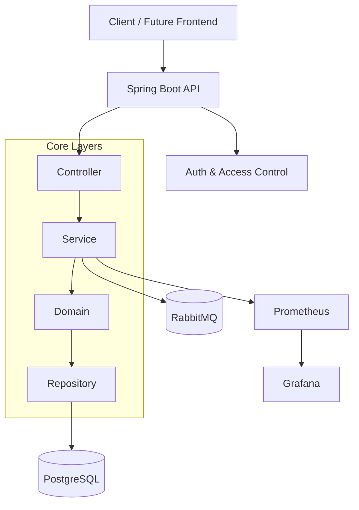

# Orkestra360 — Backend

**Orkestra360** is a SaaS, multi-tenant, event-driven backend platform designed to simulate a **production-grade system** with strong emphasis on architecture, scalability, and observability.

This project is intentionally built as a **learning-driven system**, focusing on applying real-world engineering practices expected at mid/senior levels, rather than delivering a quick MVP.

The development follows an **incremental, phase-based approach**, where each phase introduces new architectural concerns while maintaining code quality, testability, and system integrity.


## Motivation

Modern backend systems require much more than CRUD operations. This project aims to demonstrate:

* How to design systems using **Domain-Driven Design (DDD)**
* How to evolve from a **modular monolith to distributed architecture**
* How to build **secure, observable, and scalable systems**
* How to apply **clean code and SOLID principles in practice**

**Orkestra360** is designed as a **portfolio-grade project** that reflects real engineering challenges.


## High-Level System Design

The system is structured to evolve over time, starting as a well-designed monolith and progressively incorporating distributed system patterns such as messaging, caching, and observability.

### Architecture Overview




## Core Architectural Principles

* **Domain-Driven Design (DDD)**
* **Separation of concerns (layered architecture)**
* **Business logic isolated in the domain layer**
* **Stateless application design**
* **Event-driven communication (RabbitMQ)**
* **Observability-first mindset**


## Tech Stack

* **Java 17**
* **Spring Boot**
* **PostgreSQL**
* **RabbitMQ**
* **Flyway (database migrations)**
* **Docker & Docker Compose**
* **Prometheus & Grafana (planned)**
* **GitHub Actions (planned CI/CD)**


## Development Strategy (Phased Approach)

The system is intentionally built in **incremental phases** to ensure focus, clarity, and quality.

### Phase 1 — Foundation (Current)

* Project setup
* DDD structure
* Core entity modeling
* Basic CRUD operations
* Database integration (PostgreSQL + Flyway)
* Initial test coverage

### Phase 2 — Security

* JWT authentication
* RBAC (Role-Based Access Control)
* Ownership validation
* Rate limiting (initial version)

### Phase 3 — Messaging

* Event-driven architecture
* RabbitMQ integration
* Asynchronous processing

### Phase 4 — Observability

* Metrics with Prometheus
* Dashboards with Grafana
* Structured logging

### Phase 5 — Performance

* Redis caching
* Performance optimization

### Phase 6 — Advanced Security

* ABAC (Attribute-Based Access Control)
* Fine-grained authorization policies


## Planned Features

* Task management (core domain)
* Workflow automation (event-based)
* Notification system
* Audit logging (event sourcing-inspired)
* Multi-tenant support
* Observability dashboards


## Future Frontend

A dedicated frontend application (React-based) will be developed separately to provide:

* Operational dashboards
* Real-time system metrics visualization
* Task and workflow management UI


## Getting Started

### Build application

```bash
make build
```

### Start application with Docker Compose

```bash
make up
```

### Stop application and remove containers

```bash
make down
```


## API Documentation

Swagger UI available at:

http://localhost:8080/swagger-ui.html


## Project Structure

The project follows a **DDD-inspired layered architecture**:

* `domain` → business rules and core logic
* `service` → orchestration layer
* `controller` → REST API layer
* `repository` → data access
* `dto` → data transfer objects
* `config` → infrastructure configuration
* `exception` → global error handling


## Current Status

**Phase 1 — Foundation in progress**

The project is fully bootstrapped with:

* working infrastructure (Docker, PostgreSQL, RabbitMQ)
* base architecture defined
* ready for domain modeling and feature implementation


## Final Notes

This project prioritizes:

* **clarity over shortcuts**
* **architecture over speed**
* **learning over premature optimization**

Each phase builds on top of the previous one, ensuring a solid and extensible foundation.
